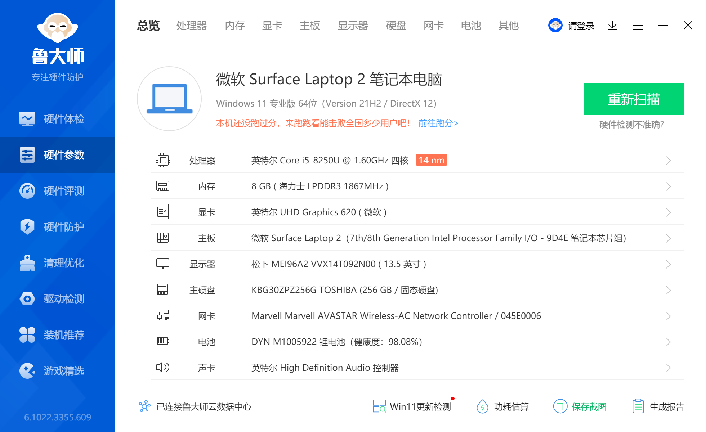

# Hackintosh Configuration for Surface Laptop 2 (Mojave 10.14.4)

Highly recommend to install **Mojave 10.14.4**, I had upgraded system to Mojave10.14.6 through the official patch, but when i install the monterey patch, there is something wrong. 

## PC Info

- 电脑型号               Surface Laptop 2 
  操作系统               Windows 11 专业版 64位（Version 21H2 / DirectX 12）
- 处理器                 英特尔 Core i5-8250U @ 1.60GHz 四核
- 主板                   微软 Surface Laptop 2（7th/8th Generation Intel Processor Family I/O - 9D4E 笔记本芯片组）
- 显卡                   英特尔 UHD Graphics 620 ( 微软 )
- 内存                   8 GB ( 海力士 LPDDR3 1867MHz )
- 主硬盘                  KBG30ZPZ256G TOSHIBA (256 GB / 固态硬盘)
- 显示器                 松下 MEI96A2 VVX14T092N00 ( 13.5 英寸  )
- 声卡                   英特尔 High Definition Audio 控制器
- 网卡                   Marvell Marvell AVASTAR Wireless-AC Network Controller / 045E0006
- 传感器 HID环境光传感器
- 电池 Microsoft Surface ACPI-Compliant Control Method Battery
- 键盘 HID Keyboard Device(Surface Keyboard) | 驱动程序文件 SurfaceKIP_135.2179.256.bin
- 蓝牙 
  - Bluetooth Device（RFCOMM Protocol TDI） 
  - Marvell AVATAR Bluetooth Radio Adapter
  - Microsoft 蓝牙LE枚举器
  - Microsoft蓝牙枚举器
- 相机 Intel(R) AVStream Camera 2500

## Working 

- Suspend / Sleep
- Touchpad
- Graphics
- Sound
- USB 
- Hidpi
-  items not mentioned in Not Working list

## Not Working

- Keyboard
- WIFI
- Network
- TouchScreen

## Brief Tutorial

### Prework

- DiskGenius分区管理工具

- balenaEtcher 黑苹果镜像制作工具

- Mojave10.14.4 安装镜像https://mirrors.dtops.cc/ISO/
- Proper EFI 

### Steps

1. Flash macos image to usb with etcher
1. Set up BIOS（stop secure boot and choose usb boot）
1. Start  and follow installation guidance（System will boot twice，dont be panic）
1. If step3 not working，use diskgenius to replace your EFI with the image EFI，then redo step3
1. If step3 worked，when u login the system，use diskgenius to replace your EFI with the image EFI
1. Reboot and unplug your usb
1. Done

## Notes

- 这里EFI分区必须大于200M，最好设置成300MB。

​       (EFI>200MB, 300MB should be enough.)

> 这里我鼓捣了好久，重新搞了好几次，最后发现还是用WindowsPE设置好EFI分区为300MB后重新用windows安装器安装后才能正常抹掉磁盘。

## Issues

- [安装黑苹果出现 Mediakit报告设备上的空间不足以执行请求操作 的解决方法-黑苹果动力 (mfpud.com)](https://www.mfpud.com/topics/3567/)

- [Surface turns on and shows "Couldn't find a bootable operating system" (microsoft.com)](https://support.microsoft.com/en-us/topic/surface-turns-on-and-shows-couldn-t-find-a-bootable-operating-system-b8e6c5b8-7b09-81bb-bfd9-bc118930439c)
- [这个安装macOS Mojave 应用程序副本已损坏，不能用来安装Mac OS - 知乎 (zhihu.com)](https://zhuanlan.zhihu.com/p/88597219)
- [华硕z370-a安装黑苹果卡+加号等问题解决方案 - 五毛的笔记本 (wumao.org)](https://www.wumao.org/720.html)
- [USB Map 解决 AX200 蓝牙不出现的问题-黑苹果 Big Sur 11.5.2-TUF B550M PLUS WI-FI_das2m的博客-CSDN博客_ax200蓝牙不稳定](https://blog.csdn.net/zhangyingda/article/details/119861412)
- [黑苹果通过手机usb共享网络上网_哔哔哔Lab的博客-CSDN博客_黑苹果usb共享网络](https://blog.csdn.net/qq_16224495/article/details/82882832)
- [黑苹果big sur版本安装安卓USB共享网络（100%成功）_mob604756f5c18e的技术博客_51CTO博客](https://blog.51cto.com/u_15127597/4370915)
- [Surface Pro6黑苹果外接显示器开启原生HiDPi显示效果 - 简书 (jianshu.com)](https://www.jianshu.com/p/9c9dd3488597)

## Refs

1. [黑果小兵的部落阁 (daliansky.net)](https://blog.daliansky.net/)
1. [ OpenCore Install Guide (dortania.github.io)](https://dortania.github.io/OpenCore-Install-Guide/installer-guide/winblows-install.html#downloading-macos)
1. [Surface Pro 6超详细教程之安装windows10和黑苹果macOS 10.14双系统](https://macoshome.com/hackintosh/hcourse/1334.html)
1. https://www.cnblogs.com/douyini/p/11587387.html
1. [jordy-kommeren/hackintosh-surface-laptop-2: Hackintosh Configuration for Surface Laptop 2 (github.com)](https://github.com/jordy-kommeren/hackintosh-surface-laptop-2)
1. [molie34/Surface-Pro-6-macOS: Surface Pro 6 黑苹果全球首发 (github.com)](https://github.com/molie34/Surface-Pro-6-macOS)
1. [olm3ca/Surface-Laptop-Go: MacOS, ChromeOS and Linux install guides for the Microsoft Surface Laptop Go. (github.com)](https://github.com/olm3ca/Surface-Laptop-Go)
1. [苹果电脑macOS各版本系统镜像(含其它系统镜像)下载](https://mirrors.dtops.cc/ISO/)
1. [从零开始构建OpenCore的配置文件 - 知乎 (zhihu.com)](https://zhuanlan.zhihu.com/p/350991291)
1. [olm3ca/Surface-Laptop-Go: MacOS, ChromeOS and Linux install guides for the Microsoft Surface Laptop Go. (github.com)](https://github.com/olm3ca/Surface-Laptop-Go)
1. [bigsadan/surface-pro-4-hackintosh: 除全球无解的触摸屏，内置WIFI蓝牙摄像头外，己解决所有问题，近乎完美 (github.com)](https://github.com/bigsadan/surface-pro-4-hackintosh)
1. [HankDeTank05/vanilla-laptop-guide-opencore: my efi folder for my surface pro 2017 hackintosh (github.com)](https://github.com/HankDeTank05/vanilla-laptop-guide-opencore)